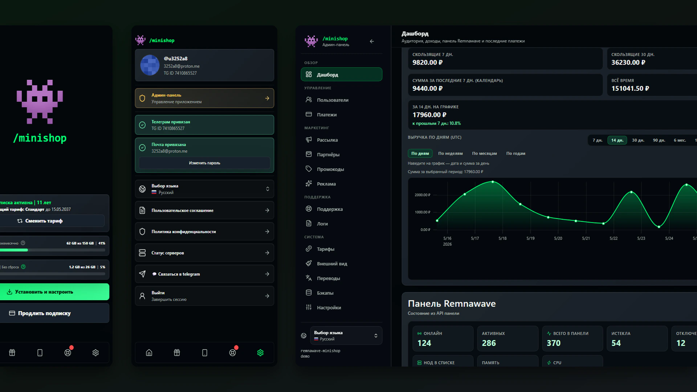

# Remnawave Minishop



[English README](README.en.md) is available for contributors who need a compact setup and
verification map. Русские `README.md` и [CONTRIBUTING.md](CONTRIBUTING.md) остаются
каноническими.

Remnawave Minishop - Telegram-бот и Web App (Mini App) для продажи и управления подписками панели [Remnawave](https://docs.rw/). Бот обрабатывает регистрацию, оплату, продление, пробный период, промокоды, рефералов и поддержку в чате. Web App показывает ссылку подключения, срок действия, трафик, оплату, устройства и вход по Telegram Mini Apps `initData`, Telegram OAuth / OpenID Connect и одноразовому email-коду.

Проект является переработанным форком [kavore/remnawave-tg-shop](https://github.com/kavore/remnawave-tg-shop). Для переноса данных из прежнего стека и других ботов используйте [раздел миграций](docs/migrations/index.md).

## Возможности

Для пользователей:

- регистрация с выбором русского или английского языка;
- просмотр статуса подписки, даты окончания, ссылки подключения и трафика;
- покупка подписок с гибким выбором лимитов устройств, обычного и premium-трафика, а также отдельные пакеты трафика и докупки после оформления;
- Web App / Mini App с входом через Telegram или email;
- встроенные инструкции установки в Mini App: личный экран `/install` и публичная ссылка `/s/<token>` для передачи инструкции;
- пробный период, промокоды и реферальная программа;
- оплата через YooKassa, FreeKassa, Platega, SeverPay, Wata, CryptoPay, Heleket, PayKilla, LAVA, Pally, CloudPayments, Stripe, Tribute и Telegram Stars;
- тикеты поддержки в Web App и внешняя ссылка на поддержку;
- раздел "Мои устройства" при включенном `MY_DEVICES_SECTION_ENABLED`.

Для администраторов:

- админ-панель для пользователей из `ADMIN_IDS` (только при входе через Telegram, не для аккаунтов только с email);
- статистика пользователей, подписок, платежей и синхронизации с Remnawave;
- список пользователей с поиском, фильтрами и колонкой premium-трафика;
- блокировка пользователей, поддержка через тикеты, рассылки, промокоды, логи действий и настройка разрешенных параметров приложения поверх `.env`;
- редактор JSON-каталога тарифов с моделями на срок/по трафику, гибкими checkout-лимитами, Internal Squads, premium-сквадами и HWID-пакетами;
- настройки инструкций подключения: чтение конфига Subscription Page из Remnawave Panel, опциональное JSON-переопределение и переключатель поведения кнопок бота;
- ручная синхронизация пользователей и подписок с панелью.

## Документация

- [Входная страница документации](docs/index.md) - маршрут по установке, настройке, платежам, админке и диагностике.
- [Единый dev stand](docs/development/dev-stand.md) - локальный Docker Compose стенд
  с Mini Shop, Remnawave Panel, Subscription Page, тестовыми сидами и
  full-stack QA (`npm run qa:fullstack`).
- [Развертывание](docs/getting-started/deployment.md) - Docker Compose, Caddy, Angie, Nginx, Pangolin/Newt и запуск без обратного прокси.
- [Настройка окружения](docs/getting-started/configuration.md) - bootstrap `.env` и рекомендуемая настройка через Web App админку.
- [Переменные `.env`](docs/configuration/env-vars.md) - полный справочник всех env-ключей по разделам.
- [Бэкапы и восстановление](docs/features/backups.md) - автоматические архивы, Telegram-отправка и restore через админку.
- [Партнёрская программа](docs/features/partner-program.md) - заявки, ссылки, комиссии, ручные выплаты, оплата балансом и эксплуатационные процедуры.
- [Тарифы](docs/features/tariffs.md) - каталог тарифов, гибкие лимиты при оформлении, отдельные несгораемые докупки, premium-сквады, смена тарифа, HWID-лимиты и обработка трафика.
- [Админ-панель](docs/features/admin-panel.md) - права доступа, настройки, редактор тарифов, premium-сквады и сохранение JSON-каталога.
- [Веб-приложение / Mini App](docs/features/web-app.md) - отдельный порт, домен, инструкции установки и реферальные ссылки.
- [Telegram-авторизация](docs/features/telegram-auth.md) и [вход по email](docs/features/email-login.md) - настройка BotFather/OAuth и SMTP-логина.
- [Поддержка пользователей / тикеты](docs/features/support.md) - тикеты в Mini App, входящий список админки, уведомления, лимиты и внешняя ссылка поддержки.
- [Темы Web App](docs/features/webapp-themes.md) - кастомные темы, настройка внешнего вида, логотипы, CSS/ассеты и пайплайн создания новой темы.
- [Миграции](docs/migrations/index.md) - готовые сценарии переноса с `remnawave-tg-shop` и Remnashop.
- [Миграция с remnawave-tg-shop](docs/migrations/remnawave-tg-shop.md) и [Remnashop](docs/migrations/remnashop.md) - сценарии через общий install wizard.
- [Рецепты для контрибьюторов](docs/development/how-to.md) - пошагово: добавить платёжного провайдера, доменное событие или HTTP-эндпоинт (см. также [CONTRIBUTING.md](CONTRIBUTING.md)).

## Совместимость

Интеграция с API панели Remnawave (вебхуки, пользователи, подписки, статистика в админке и т.д.) **протестирована** на панели Remnawave версии **`> 2.7.0`**. Более старые версии могут работать частично или не работать из‑за изменений в API.

## Стек

Сборка и runtime задаются **deploy/docker/Dockerfile** и **docker-compose.yml**; точные версии пакетов — в **backend/requirements.txt** и **frontend/package.json**.

| Слой | Технологии |
| --- | --- |
| Backend | Python **3.12**, [aiogram](https://docs.aiogram.dev/) 3.x (Telegram), **aiohttp** (HTTP и Web App), **SQLAlchemy** 2 async, **asyncpg**, **Pydantic** / pydantic-settings, **httpx**, платёжные SDK (в т.ч. YooKassa), **PyJWT** |
| Данные | **PostgreSQL** **17** (сервис `postgres` в Compose) и **Redis** **7** (сервис `redis`) |
| Сборка Web App | **Node.js** **22**, **Svelte** **5**, **Vite**, **Tailwind CSS** 4; артефакты попадают в шаблоны `backend/bot/app/web/templates/` |

Локальная разработка без Docker возможна при установленных Python 3.12, PostgreSQL и (для пересборки фронта) Node 22; типичный сценарий — всё через Compose.

## Быстрый старт

Требования:

- Docker Engine **25.0+** и Docker Compose **2.20.2+**; install wizard проверяет версии до
  настройки, предлагает обновить runtime до latest stable и валидирует итоговый
  `docker compose config` до `pull/up`;
- рабочая панель Remnawave версии **`> 2.7.0`** (см. раздел «Совместимость»);
- токен Telegram-бота;
- публичные домены для webhook и Mini App.

```bash
git clone https://github.com/3252a8/remnawave-minishop
cd remnawave-minishop
cp .env.example .env
nano .env
docker compose up -d --build
docker compose logs -f backend worker frontend
```

Минимально заполните в `.env`:

- `BOT_TOKEN` - токен Telegram-бота;
- `ADMIN_IDS` - Telegram ID администраторов через запятую;
- `WEBHOOK_BASE_URL` - публичный URL вебхуков;
- `POSTGRES_USER`, `POSTGRES_PASSWORD`, `POSTGRES_DB` - доступы PostgreSQL;
- `WEBAPP_ENABLED=True` - включает Web App и админку для первого входа;
- `WEBAPP_SESSION_SECRET`, `WEBHOOK_SECRET_TOKEN` - стабильные секреты;
- `SUBSCRIPTION_MINI_APP_URL` - публичный HTTPS URL Mini App/frontend, например `https://app.domain.com/`;
- `PANEL_API_URL`, `PANEL_API_KEY`, `PANEL_WEBHOOK_SECRET` - доступ к Remnawave;
- `TRUSTED_PROXIES` - оставьте дефолт для Docker/Caddy/Angie/Nginx/Newt или укажите IP/CIDR своего reverse proxy, чтобы IP allowlist платежных webhook видел реального провайдера;
- остальные настройки удобнее задать в Web App админке.

В Remnawave Panel укажите `WEBHOOK_URL` как публичный адрес Minishop с путем `/webhook/panel`, например `https://app.example.com/webhook/panel`. Секрет вебхука задается в самой Remnawave Panel; это же значение вставьте в `PANEL_WEBHOOK_SECRET` в `.env` или в **Система -> Настройки -> Remnawave Panel** в админке.

После первого входа в админку настройте тарифы, платежные провайдеры, внешний вид, поддержку, уведомления и инструкции подключения через UI. Инструкции установки включены по умолчанию, читают Subscription Page config из Remnawave Panel и при проблемах с конфигом откатываются к обычной ссылке подключения. Полный справочник env-переменных: [docs/configuration/env-vars.md](docs/configuration/env-vars.md).

Для каталога тарифов используется `TARIFFS_CONFIG_PATH` со значением по умолчанию `data/tariffs.json`. Пример формата лежит в [data/tariffs.example.json](data/tariffs.example.json), подробности - в [docs/features/tariffs.md](docs/features/tariffs.md).

В Docker этот файл должен быть доступен не только `backend` и `worker`, но и одноразовому сервису `migrate`: мигратор читает каталог тарифов при привязке существующих подписок к тарифу по умолчанию. В текущих compose-файлах весь `/app/data` уже смонтирован в `migrate`, `backend` и `worker`; если переносите compose вручную, сохраните одинаковый mount для всех трех сервисов.

В compose-примерах `/app/data` монтируется из папки `./data` рядом с `docker-compose.yml`. Заранее создайте каталог и отдайте его пользователю контейнера. Это нужно для сохранения `data/tariffs.json`, каталога тем `data/themes` и кеша логотипа Web App:

```bash
mkdir -p data/themes data/webapp-logo data/tariffs
touch data/locales-overrides.json
chown -R 10001:10001 data
chmod -R u+rwX data
```

## Полезные команды

```bash
# Полная локальная проверка перед PR
npm run check

# Быстрый smoke-прогон во время разработки
npm run check:quick

# Локальная сборка и запуск
docker compose up -d --build

# Единый dev stand для разработки и full-stack QA
make dev

# Логи приложения
docker compose logs -f backend worker frontend

# Рекомендуемый продакшен-вариант с Caddy
cd deploy/examples/caddy      # или angie, nginx, newt, no-proxy
cp .env.example .env
nano .env
docker compose up -d

# Запуск из готового образа с конкретным тегом
IMAGE_TAG=3.1.0 docker compose up -d
```

Для продакшен-запуска удобнее брать готовые папки из [`deploy/examples`](deploy/examples), а читать каноничные инструкции в [docs/getting-started/deployment.md](docs/getting-started/deployment.md). Предпочтительный вариант для обычного публичного сервера - Caddy: он сам выпускает и продлевает HTTPS-сертификаты. В папках рядом с compose лежат только конфиги и короткие ссылки на документацию.

Имена образов для релизов:

- `ghcr.io/3252a8/remnawave-minishop-backend`
- `ghcr.io/3252a8/remnawave-minishop-worker`
- `ghcr.io/3252a8/remnawave-minishop-frontend`
- `docker.io/3252a8/remnawave-minishop-backend`
- `docker.io/3252a8/remnawave-minishop-worker`
- `docker.io/3252a8/remnawave-minishop-frontend`
