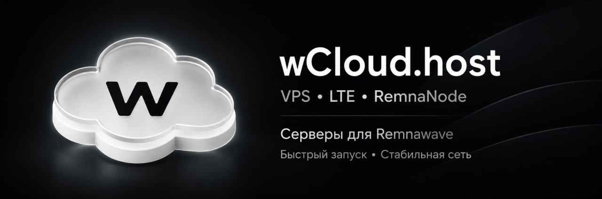

# Системные требования

Remnawave Minishop запускается как Docker Compose-стек: вместе с приложением работают
PostgreSQL, Redis, backend, worker и frontend. Для небольшого проекта достаточно базового VPS,
но запас по памяти заметно упрощает обновления, резервное копирование и диагностику.

## Конфигурация VPS

| Сценарий | CPU | Оперативная память | Свободное место на SSD |
| --- | ---: | ---: | ---: |
| Минимальный запуск или небольшой проект | 1 vCPU | 1 ГБ | от 10 ГБ |
| Рекомендуемая конфигурация для продакшена | 2 vCPU | 2 ГБ | от 20 ГБ |
| Повышенная нагрузка, частые бэкапы или несколько сервисов | от&nbsp;4&nbsp;vCPU | от 4 ГБ | от 40 ГБ |

1 vCPU и 1 ГБ RAM — рабочая нижняя граница для небольшого Minishop. На таком сервере
желательно добавить 1–2 ГБ swap и следить за свободным местом. Для обычного продакшена лучше
сразу выбрать 2 vCPU и 2 ГБ RAM: этого запаса достаточно для штатного запуска контейнеров,
обновлений и кратковременных пиков нагрузки.

Таблица учитывает только Minishop. Если на том же VPS работают Remnawave Panel, reverse proxy,
мониторинг или другие приложения, сложите их требования и выберите более крупную конфигурацию.
Размер диска также нужно увеличивать по мере роста базы данных, логов и количества локальных
резервных копий.

:::tip[Друзья проекта]

Для размещения Minishop можно [арендовать VPS у wCloud](https://wcloud.host/?from=yKyhIg2jXbNdWZsFzd_tyxLVBYiicNjK).
У этого же сервиса доступны серверы для Remnawave Node, включая варианты, оптимизированные для
работы в LTE-сетях.
:::

## Операционная система и программы

- 64-битный Linux на архитектуре `amd64` (x86_64). Проще всего использовать актуальный Ubuntu
  Server или Debian без графической оболочки.
- Доступ `root` или пользователь с `sudo` для установки Docker и настройки сети.
- Docker Engine **25.0+** и Docker Compose plugin **2.20.2+**. Нужна команда
  `docker compose`; устаревший отдельный `docker-compose` не используется.
- `curl` для запуска install wizard. Для служебных загрузок мастер также умеет использовать
  `wget`, а `openssl` нужен для генерации секретов и проверки TLS-сертификатов.
- Исходящий доступ в интернет для скачивания установщика и Docker-образов, а также для работы с
  Telegram Bot API, Remnawave Panel и платежными провайдерами.

Python, Node.js, PostgreSQL и Redis отдельно на VPS устанавливать не нужно — штатное
развертывание запускает все необходимые компоненты в контейнерах. Git нужен только при ручном
клонировании репозитория или сборке из исходников.

## Сеть и внешние зависимости

- Рабочая Remnawave Panel версии **выше 2.7.0**, API-ключ панели и секрет ее вебхука.
- Токен Telegram-бота и Telegram ID администраторов.
- Публичные DNS-имена и HTTPS для webhook/backend и Mini App/frontend. Это могут быть два домена
  или один домен при подходящей схеме проксирования.
- Для Caddy, Angie или Nginx откройте входящие TCP-порты 80 и 443 и направьте DNS-записи на VPS.
  При развертывании через Pangolin/Newt входящие порты на сервере приложения не требуются.

После подготовки сервера переходите к [установке](setup.md).
